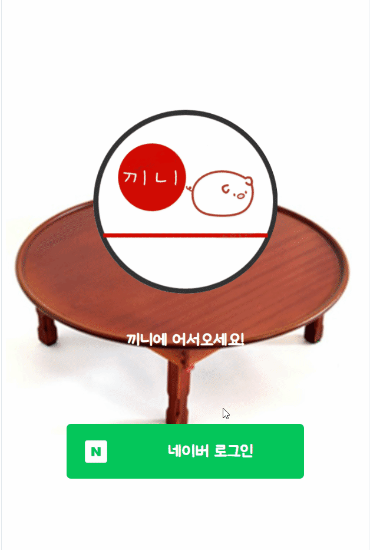
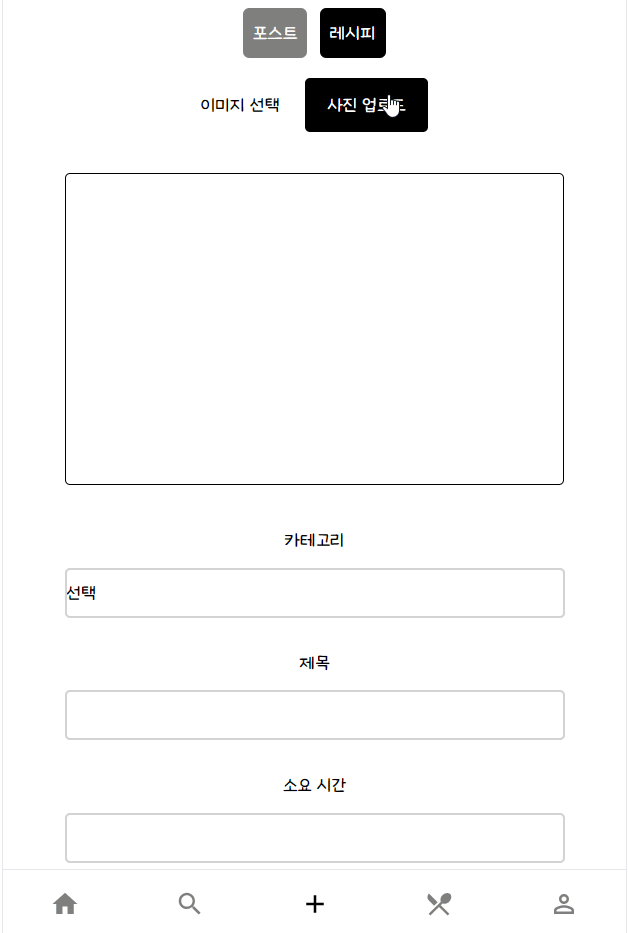
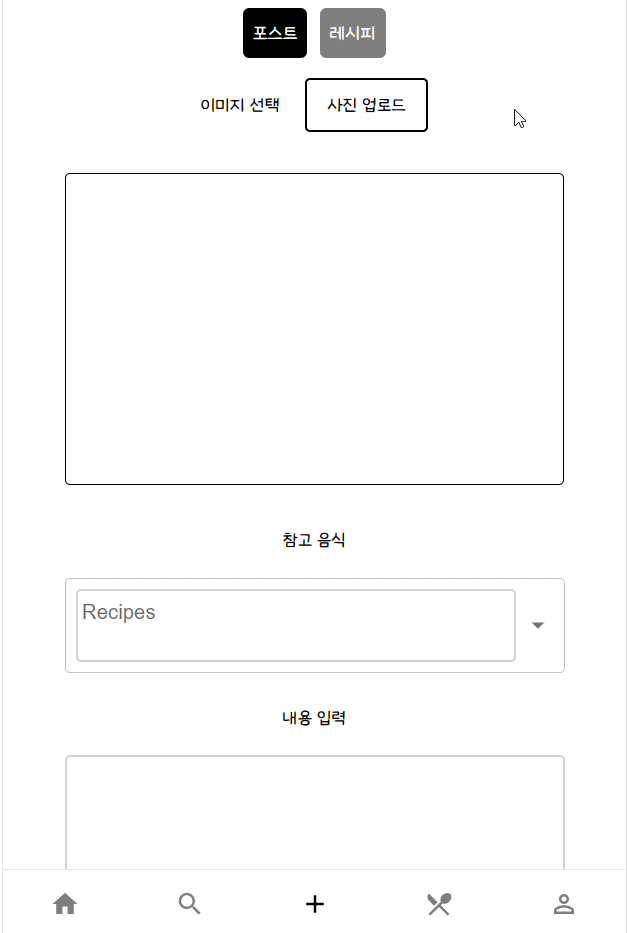
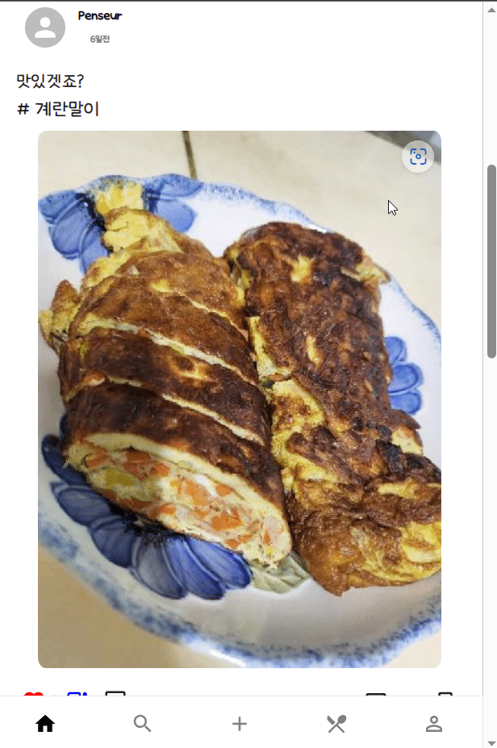
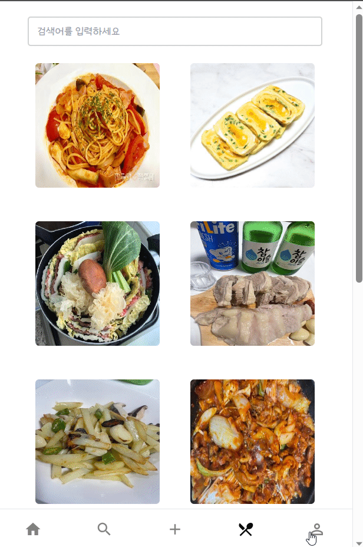
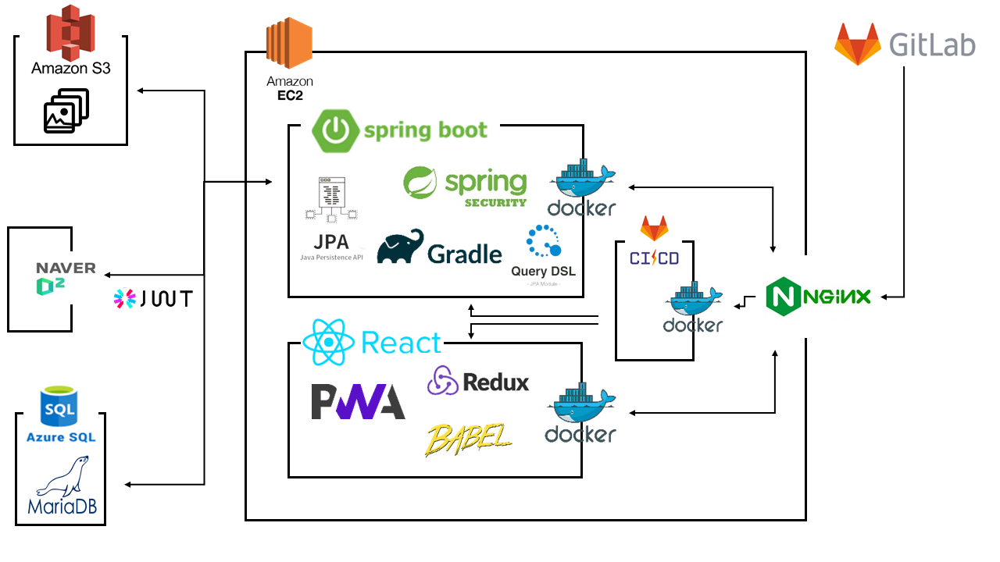

# Kkini🍴

# 서비스 소개 🚩
* 자취 요리 가이드 및 공유 SNS 서비스입니다.
* 일상의 가장 가까운 부분인 식사를 공유하며 공감대를 형성하고 싶어 개발을 시작했습니다.
* 치솟는 물가에 허덕이는 주머니 사정을 지킬 수 있습니다!
* 당신의 요리 실력을 뽐내보세요!

# 개발 기간 🏁
* 7/4 ~ 8/17 (7주)

# 팀원소개 🤝
## FrontEnd 🖌️
<table align="center">
    <tr align="center">
        <td style="min-width: 150px;">
            <a href="https://github.com/nickname">
              
               
              <b>nickname</b>
            </a>
        </td>
        <td style="min-width: 150px;">
            <a href="https://github.com/arctophile19">
              
               
              <b>arctophile19</b>
            </a> 
        </td>
        <td style="min-width: 150px;">
            <a href="https://github.com/seungtae1377">
              
               
              <b>seungtae1377</b>
            </a> 
        </td>
    </tr>
    <tr align="center">
        <td>
            김승영
        </td>
        <td>
            박태규
        </td>
        <td>
            이승태
        </td>
    </tr>
</table>

## BackEnd 🗄️
<table align="center">
    <tr align="center">
        <td style="min-width: 150px;">
            <a href="https://github.com/imbeom35">
              
               
              <b>imbeom35</b>
            </a> 
        </td>
        <td style="min-width: 150px;">
            <a href="https://github.com/byh9811">
              
               
              <b>byh9811</b>
            </a> 
        </td>
        <td style="min-width: 150px;">
            <a href="https://github.com/cutepassions">
              
               
              <b>cutepassions</b>
            </a> 
        </td>
    </tr>
    <tr align="center">
        <td>
            김범창
        </td>
        <td>
            배용현
        </td>
        <td>
            진병욱
        </td>
    </tr>
</table>

# 기능 소개 💡

|                           로그인                           |                         레시피 등록                          |
|:-------------------------------------------------------:|:-------------------------------------------------------:|
|  |  |

|                         포스트 등록                          |                        금액 평가                         |
|:-------------------------------------------------------:|:----------------------------------------------------:|
|  |  |

|                         추천 피드                         |                         도감                          |
|:-----------------------------------------------------:|:---------------------------------------------------:|
|  |   |

 

# 시스템 구조 🦴

|         Service Architecture          |
|:-------------------------------------:|
|  |  

 

# ERD 💾

|                                           Entity Relational Diagram                                            |
|:--------------------------------------------------------------------------------------------------------------:|
|  |  

